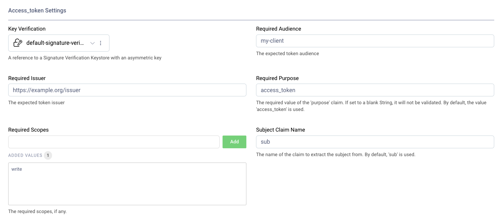

AccessTokenAuthenticator Authenticator Plug-in
===================================

.. image:: https://img.shields.io/badge/quality-production-green
    :target: https://curity.io/resources/code-examples/status/

.. image:: https://img.shields.io/badge/availability-binary-blue
    :target: https://curity.io/resources/code-examples/status/

A custom Authenticator plugin for the Curity Identity Server.

This plugin allows users to authenticate using HAAPI by first obtaining an access token via other means.

That allows a form of token exchange where the end user may be prompted to consent to upscoping, for example.

The following configuration settings are available:

* ``required-issuer`` - required token issuer.
* ``required-audience`` - required token audience. Optional.
* ``required-scopes`` - required token scopes. Optional.
* ``required-purpose`` - required token ``purpose``. Default: ``access_token``. If set to a blank string, this will be ignored.
* ``subject-claim-name`` - the name of the subject claim. Default: ``sub``.
* ``key-verification/id`` - ID of an existing token signature verification key.

.. note::
    This plugin should not be used by users to authenticate using a browser because it is a bad security practice to expose
    access tokens directly to end users. Use `HAAPI`_ instead.

Building the Plugin
~~~~~~~~~~~~~~~~~~~

Build the plugin by issuing the command ``mvn package``. This will produce a JAR file in the ``target`` directory, which can be installed.

Installing the Plugin
~~~~~~~~~~~~~~~~~~~~~

To install the plugin, copy the compiled JAR and JARs of the dependencies not provided by the Curity Identity Server from the ``target`` directory into the :file:`${IDSVR_HOME}/usr/share/plugins/AccessTokenAuthenticator`. `${IDSVR_HOME}` is the installation folder of the Curity Identity Server. Inisde of a Docker container that uses an official image of the Curity Identity Server, the istallation directory is `/opt/idsvr`. Make sure to copy the JARs on each node that run the Curity Identity Server, including the admin node. Restart the Curity Identity Server so that it can load the plugin. For more information about installing plugins, refer to the `curity.io/plugins`_.

Required Dependencies
"""""""""""""""""""""

For a list of the dependencies and their versions, run ``mvn dependency:list``. Ensure that all of these are installed in
the plugin directory, except for the JARs provided by the Curity Identity Server (you can find the provided dependencies in `the documentation`_). Otherwise, they will not be accessible to this plug-in and run-time errors will result.

More Information
~~~~~~~~~~~~~~~~

Please visit `curity.io`_ for more information about the Curity Identity Server.

.. _curity.io/plugins: https://curity.io/docs/idsvr/latest/developer-guide/plugins/index.html#plugin-installation
.. _curity.io: https://curity.io/
.. _the documentation: https://curity.io/docs/idsvr/latest/developer-guide/plugins/index.html#server-provided-dependencies-1
.. _OpenID Connect authenticator: https://curity.io/docs/idsvr/latest/authentication-service-admin-guide/authenticators/oidc.html
.. _HAAPI: https://curity.io/resources/haapi/
